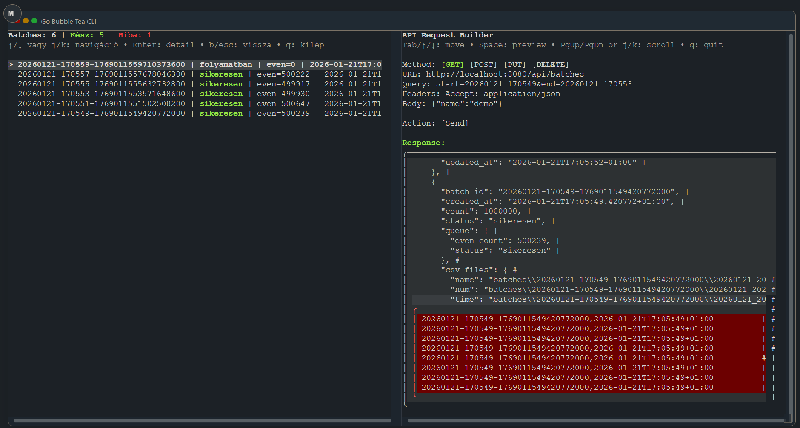

# Go batch + TUI

This project generates batches of `DataRecord` items, writes them into three
separate CSV files, builds a queue from even `num` values, and exposes status
in a JSON file. A Bubble Tea TUI watches the JSON files in real time.



## Requirements

- Go 1.22+

Dependencies (installed via `go mod tidy`):
- `github.com/charmbracelet/bubbletea` v1.3.10
- `github.com/charmbracelet/bubbles` v0.21.0
- `github.com/charmbracelet/lipgloss` v1.1.0
- `github.com/fsnotify/fsnotify` v1.9.0
- `github.com/creack/pty` v1.1.24
- `github.com/gorilla/websocket` v1.5.3
- `github.com/UserExistsError/conpty` v0.1.4 (Windows)

## Project structure

- `main.go` — batch generator (records → CSV → even-queue → JSON meta)
- `data_record.go` — record generation (concurrent, streaming)
- `csv_output.go` — CSV writers (buffered)
- `even_queue.go` — even-number queue builder (streamed)
- `batch_meta.go` — JSON metadata create/update
- `cmd/tui/main.go` — TUI monitor (live file watch + detail view)
- `cmd/api_tui/main.go` — API request builder TUI
- `cmd/web/main.go` — WebSocket backend (runs the TUI in a PTY)
- `web/index.html` — minimal web client (xterm.js)

## How it works

1. **Batch generation** (`GenerateDataRecords`)
   - Creates a `batchID` with timestamp.
   - Initializes `<batchID>.json`.
   - Streams records via a channel.
2. **CSV writing** (`WriteRecordsSplitCSVStream`)
   - Writes three CSVs: name, num, time.
   - Buffered IO for speed.
3. **Even queue** (`BuildEvenQueue`)
   - Reads CSVs in lockstep.
   - Enqueues records with even `num`.
4. **JSON update** (`UpdateBatchMeta`)
   - Writes CSV paths, timings, queue status, and memory stats.
5. **TUI**
   - Watches JSON files live and shows list + detail view.

## Output

Each batch is written to its own folder:

```
batches/<batchID>/
  YYYYMMDD_<batchID>_records_name.csv
  YYYYMMDD_<batchID>_records_num.csv
  YYYYMMDD_<batchID>_records_time.csv
<batchID>.json
```

CSV headers:
- `records_name.csv`: `batch_id,name`
- `records_num.csv`: `batch_id,num`
- `records_time.csv`: `batch_id,time`

## Run

Batch generator (continuous loop):

```
go run .
```

TUI (monitor):

```
go run ./cmd/tui
```

API request builder TUI:

```
go run ./cmd/api_tui
```

Web TUI (WebSocket backend + browser client):

```
go run ./cmd/web
```

Open `http://localhost:8080` in your browser.

Windows requirement: ConPTY is available on Windows 10 1809+.
If you get `ConPtyUnsupported`, run the web server inside WSL.

### API endpoints

- `GET /api/health` → simple health check
- `GET /api/batches` → list of batches (use `?limit=10`, `?start=20260120-100000`, `?end=20260120-120000`)
- `GET /api/batches/{id}` → full batch metadata

### TUI controls

- `↑/↓` or `j/k` — move
- `Enter` — detail view
- `b` or `Esc` — back
- `q` — quit

### Web TUI options

If you want to run a prebuilt TUI binary:

```
go build -o tui ./cmd/tui
go run ./cmd/web --cmd ./tui --args ""
```

Windows:

```
go build -o tui.exe ./cmd/tui
go run ./cmd/web --cmd .\\tui.exe --args ""
```

## Notes

- The generator loops with a 1s interval between batches.
- JSON status starts as `folyamatban`, then becomes `sikeresen` or `hiba`.
